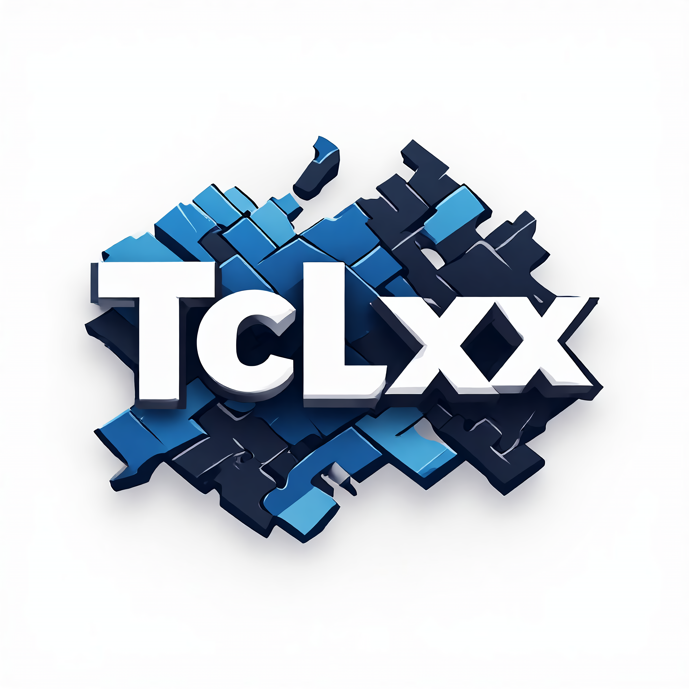

# tclxx

<p align="center">
  
</p>

`tclxx` is a header-only C++ library utilizing modern argument expansion templates to seamlessly bind native classes and functions to the Tcl interpreter.

It helps you:
- map custom C++ classes into `Tcl_Obj` safely
- convert arguments/results between Tcl and C++ types
- register Tcl commands from C++ member functions and free functions

## Install and Consume

### Option 1: Header-only source include

Add this repository's `include/` directory to your project include paths and include:

```cpp
#include "tclxx.hpp"
```

### Option 2: CMake package

Build/install:

```bash
cmake -S . -B build
cmake --build build
cmake --install build --prefix "$HOME/.local"
```

Use from another project:

```cmake
find_package(tclxx REQUIRED)
target_link_libraries(your_target PRIVATE tclxx::tclxx)
```

## Usage Guide

### 1. Define conversion behavior for your type

You only need to define how to convert your C++ type to a string and how to convert any `Tcl_Obj` to your type:

```cpp
#include "tclxx.hpp"

class MyType {
public:
    int value = 0;
};

namespace tclxx {

template <>
std::string ObjType<MyType>::ToString(const MyType& v) {
    return std::to_string(v.value);
}

template <>
MyType ObjType<MyType>::FromAny(Tcl_Interp* interp, Tcl_Obj* const obj) {
    MyType out;
    out.value = obj_cast::to<int>(interp, obj);
    return out;
}

} // namespace tclxx
```

> More `ObjType<T>` lifecycle and ownership details: [ObjType Notes](#objtype-notes)

### 2. Register commands

Use the TCLXX collection of macros to automatically bind class methods or static functions to the Tcl interpreter:

```cpp
#include "tclxx.hpp"

TCLXX_CMD_NEW(interp, "::MyType::new", MyType, int);
TCLXX_CMD_STATIC_OWNED(interp, "::MyType::origin", &MyType::origin);
TCLXX_CMD_GETTER_METHOD(interp, "::MyType::get", &MyType::getValue);
TCLXX_CMD_SETTER_METHOD(interp, "::MyType::set", &MyType::setValue);
TCLXX_CMD_UPDATER_METHOD(interp, "::MyType::update.value", &MyType::valueRef);
TCLXX_CMD_STATIC(interp, "::MyType::version", &MyType::version);
```

> See the full collection of macros in [Macro Reference](#macro-reference)

### 3. Call commands from Tcl

Note: getters pass handle values with `$`; setters and updaters pass variable names without `$` to enable field modification.

```tcl
set obj [::MyType::new 5]
::MyType::set obj 1
::MyType::update.value obj tmp {
    set tmp [expr {$tmp + 1}]
}
puts [::MyType::get $obj]
puts [::MyType::version]
```

`TCLXX_CMD_UPDATER_METHOD` expects a method with signature like `FieldType& valueRef()`.

It binds `tmp` to the field during body evaluation, writes back on success.

### 4. Expand from quickstart

See a real demo in [Demo](#demo)

## Macro Reference

- `TCLXX_CMD_NEW`: bind constructor-like wrappers (`tclxx::cmd::create`)
- `TCLXX_CMD_NEW0`: zero-argument create wrapper
- `TCLXX_CMD_NEW_SHARED` / `TCLXX_CMD_NEW0_SHARED`: create wrappers that return shared-backed handles
- `TCLXX_CMD_GETTER` / `TCLXX_CMD_GETTER_WEAK`: bind getter wrappers with weak pointer return mode
- `TCLXX_CMD_GETTER_OWNED`: bind getter wrappers with owned raw-pointer return mode
- `TCLXX_CMD_GETTER_SHARED`: bind getter wrappers with shared-pointer duplicate-sharing mode
- `TCLXX_CMD_GETTER_METHOD` / `TCLXX_CMD_GETTER_METHOD_WEAK`: bind member getter wrappers with weak pointer return mode
- `TCLXX_CMD_GETTER_METHOD_OWNED`: bind member getter wrappers with owned raw-pointer return mode
- `TCLXX_CMD_GETTER_METHOD_SHARED`: bind member getter wrappers with shared-pointer duplicate-sharing mode
- `TCLXX_CMD_SETTER` / `TCLXX_CMD_SETTER_WEAK`: bind setter wrappers with weak pointer return mode
- `TCLXX_CMD_SETTER_OWNED`: bind setter wrappers with owned raw-pointer return mode
- `TCLXX_CMD_SETTER_SHARED`: bind setter wrappers with shared-pointer duplicate-sharing mode
- `TCLXX_CMD_SETTER_METHOD` / `TCLXX_CMD_SETTER_METHOD_WEAK`: bind member setter wrappers with weak pointer return mode
- `TCLXX_CMD_SETTER_METHOD_OWNED`: bind member setter wrappers with owned raw-pointer return mode
- `TCLXX_CMD_SETTER_METHOD_SHARED`: bind member setter wrappers with shared-pointer duplicate-sharing mode
- `TCLXX_CMD_UPDATER_METHOD`: bind member updater wrappers (`tclxx::cmd::updater_member`)
- `TCLXX_CMD_STATIC` / `TCLXX_CMD_STATIC_WEAK`: bind free/static wrappers with weak pointer return mode
- `TCLXX_CMD_STATIC_OWNED`: bind free/static wrappers with owned raw-pointer return mode
- `TCLXX_CMD_STATIC_SHARED`: bind free/static wrappers with shared-pointer duplicate-sharing mode
- `TCLXX_CMD_NEW_MAKE_SHARED`: bind wrapper to convert `owned` objects to `shared`-backed handles in-place
- `TCLXX_CMD_NEW_FROM_SHARED`: bind wrapper to convert `shared` handles to `owned` deep-copies in-place

Return handling in command wrappers:
- `std::shared_ptr<T>`: exported as owned-backed handles by default (`_WEAK`/default/`_OWNED`) and as shared-backed handles for `_SHARED` wrappers.
- `std::weak_ptr<T>`: locked and exported using wrapper-selected mode; expired weak pointers return `TCL_ERROR`.
- `std::unique_ptr<T>`: safely released and exported as owned Tcl handles.
- `T&` object references: exported as weak handles to stack/static objects.
- `const T*` and `const T&` object returns are supported and exported as object handles using the selected weak/owned mode.
- Tcl is dynamically typed, and constness is enforced by wrapper conversions when mutable object access is requested.
- Commands that require mutable object access (for example `TCLXX_CMD_SETTER*` and `TCLXX_CMD_UPDATER_METHOD`) fail with `TCL_ERROR` when given const-backed handles.
- Null pointer returns are represented as empty-string handles; member and object-bound commands fail with `TCL_ERROR` instead of dereferencing null.

Getter/setter argument conversion:
- Getter/setter wrappers support `std::function<R(Args...)>` arguments in wrapped C++ functions and methods.
- From Tcl, pass either proc name (`procName`) or lambda expression (`{args body ?ns?}`); wrapper converts it to `std::function` before C++ call.

## ObjType Notes

- `ObjType<T>::TypeName()` is auto-generated from compiler type metadata by default; you can still specialize it if you want a custom stable name.
- `obj_cast::from<T*>(ptr)` defaults to weak object handles to avoid accidental ownership transfer.
- Use `obj_cast::from_owned(ptr)` when Tcl should own/delete the object.
- `obj_cast::from_shared(std::shared_ptr<T>)` defaults to `ownership::owned` (duplicate shares deep-copy pointee).
- Use `obj_cast::from_shared<tclxx::detail::ownership::shared>(std::shared_ptr<T>)` to preserve shared ownership across duplicate Tcl handles.
- `ObjType<T>::Startup(T* value)` is called only by `ObjType<T>::Set(...)` before storing the internal representation. For `std::shared_ptr<Tcl_Obj>` and `std::shared_ptr<Tcl_Obj*>`, acquisition is performed once for the first shared owner (`use_count() == 1`) to keep Tcl ref ownership aligned with shared ownership.
- `ObjType<T>::Cleanup(T* value)` is called before destruction in `FreeInternalRep`. For `std::shared_ptr<Tcl_Obj>` and `std::shared_ptr<Tcl_Obj*>`, it releases Tcl ownership only when the internal representation being destroyed is the last shared owner (`use_count() == 1`).
- `ObjType<T>::SetFromAny(...)` reuses `Set(...)` for final assignment, so all startup/acquire behavior follows the same path.

## Project Layout

Primary include:
- `include/tclxx.hpp`

Core headers:
- `include/tclxx/obj_type.hpp`: custom `Tcl_ObjType` integration (`tclxx::ObjType<T>`)
- `include/tclxx/obj_cast.hpp`: conversion helpers (`tclxx::obj_cast::to/from`)
- `include/tclxx/obj_guard.hpp`: reference-count guard for `Tcl_Obj *`.
- `include/tclxx/cmd.hpp`: command-wrapper function templates
- `include/tclxx/macro.hpp`: convenience macros to register wrappers

Tests:
- `test/obj_type_test.cpp`: GoogleTest suite for `ObjType<T>` integration and object lifetime behavior
- `test/obj_cast_test.cpp`: GoogleTest suite for `obj_cast` conversion and const-safety behavior
- `test/cmd_test.cpp`: GoogleTest suite for command wrapper registration, updater semantics, and error paths

## Demo

Point demo source: `demo/point/`

Build and run:

```bash
cmake -S . -B build -DTCLXX_BUILD_DEMOS=ON
cmake --build build
./build/demo/point/point_demo demo/point/demo.tcl
```

Expected final line:
- `all demo/point tests passed`

## Tests

Build and run tests:

```bash
cmake -S . -B build -DTCLXX_BUILD_TESTS=ON
cmake --build build
ctest --test-dir build --output-on-failure
```

The test executables use GoogleTest with titled suites/cases discovered by CTest:
- `obj_type_test`: `TclInterpFixture.PrimitiveTypeConversionsSetAndReadInternalRep`, `...OwningTypeReleasesTrackedObjectOnRefcountDrop`, etc.
- `obj_cast_test`: `TclInterpFixture.PrimitiveAndTclObjRoundTrips`, `...ConstHandlesRejectMutableExtraction`, etc.
- `cmd_test`: `CmdWrapperFixture.ConstructorGetterAndSetterCommandsWork`, `...UpdaterCommandsScrubAliasesAndPersistChanges`, `...InvalidInvocationPathsProduceActionableErrors`, etc.

## Benchmarks

Build benchmark targets:

```bash
cmake -S . -B build-bench -DTCLXX_BUILD_BENCHMARKS=ON -DTCLXX_BUILD_DEMOS=OFF -DTCLXX_BUILD_TESTS=OFF -DCMAKE_BUILD_TYPE=Release
cmake --build build-bench
```

Run C++ microbenchmarks (conversion/wrapper hot paths):

```bash
./build-bench/benchmark/tclxx_benchmark
```

The benchmark binary prints ns/op and ops/sec for representative conversion and wrapper hot paths.

## License

MIT. See `LICENSE.md`.
